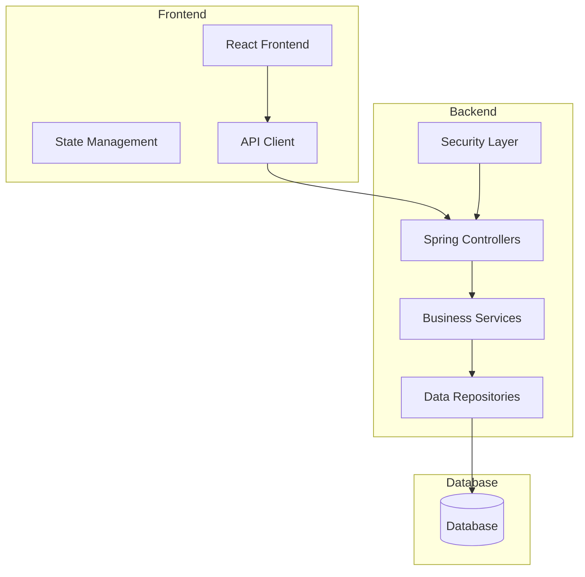
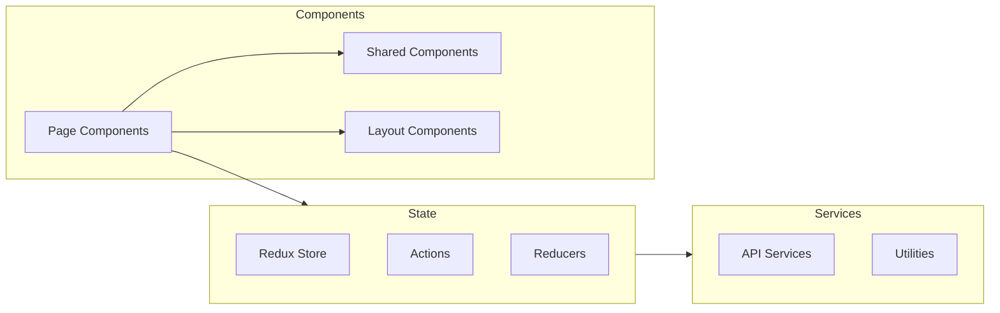
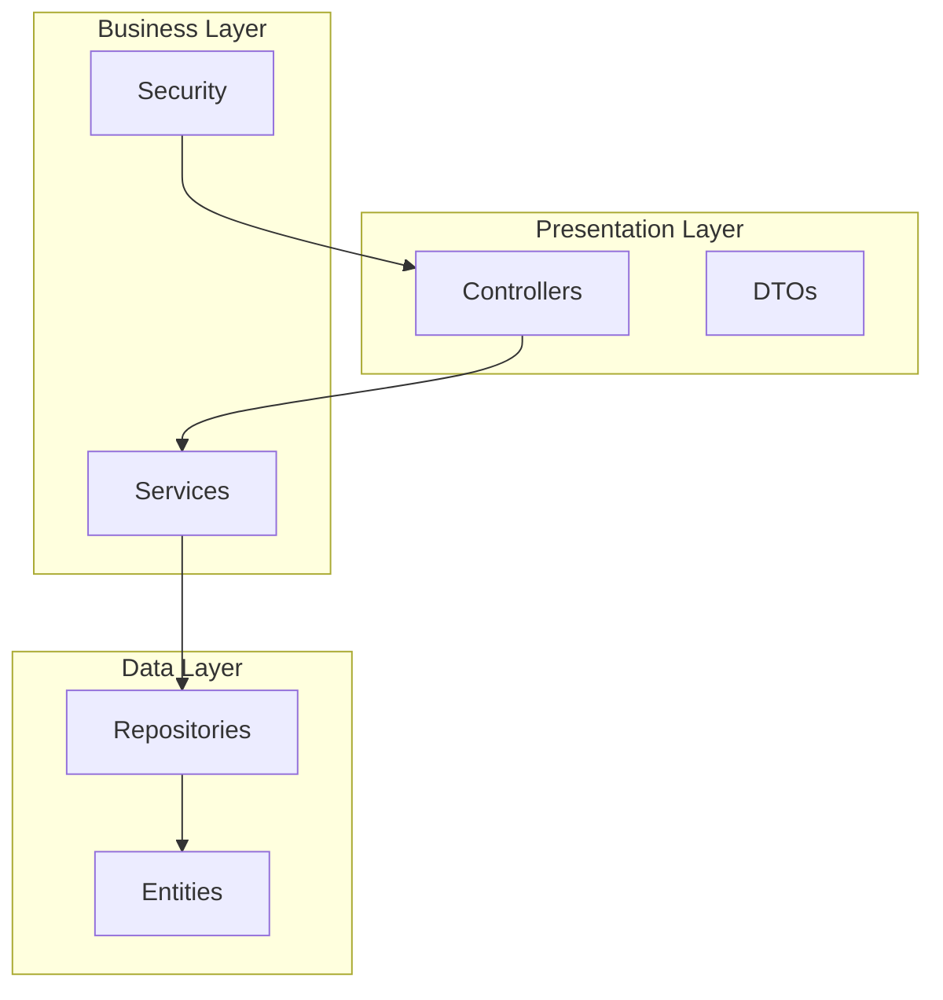
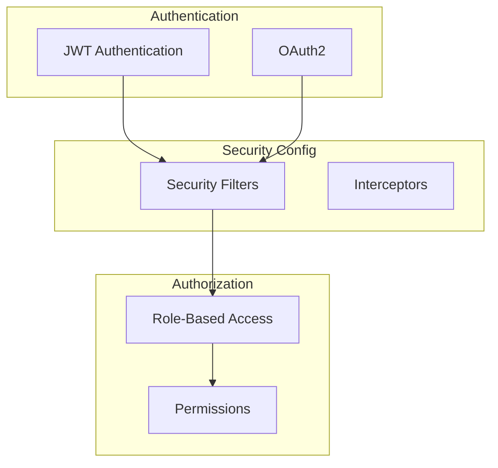
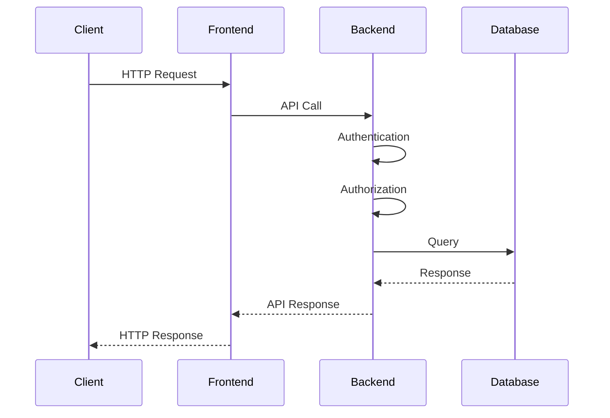
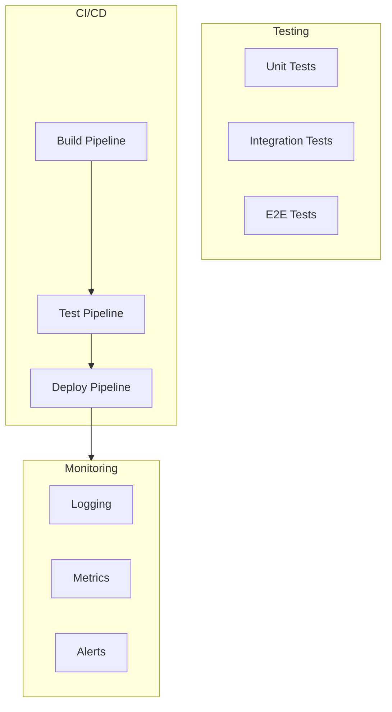

# Project Architecture Documentation

## System Overview

This project follows a modern microservices architecture with a clear separation between frontend and backend components. The system is designed to be scalable, maintainable, and follows best practices for enterprise applications.

### High-Level Architecture



## Component Details

### Frontend Architecture

The frontend is built using React with TypeScript, following a component-based architecture:



### Backend Architecture

The backend follows a layered architecture pattern:



## Security Architecture

The application implements a comprehensive security model:



## Data Flow



## Deployment Architecture

```mermaid
graph TB
    subgraph Production
        LB[Load Balancer]
        subgraph Frontend Cluster
            F1[Frontend 1]
            F2[Frontend 2]
        end
        subgraph Backend Cluster
            B1[Backend 1]
            B2[Backend 2]
        end
        DB[(Database)]
    end
    
    LB --> Frontend Cluster
    Frontend Cluster --> Backend Cluster
    Backend Cluster --> DB
```

## Quality Assurance Architecture

The project implements a comprehensive quality assurance strategy:

