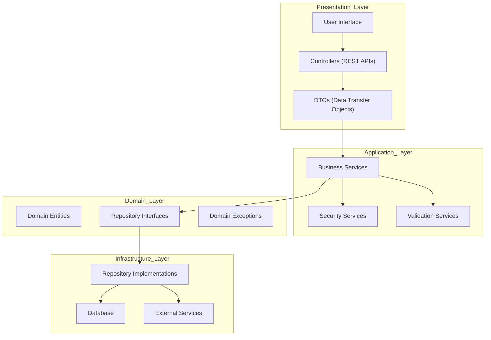
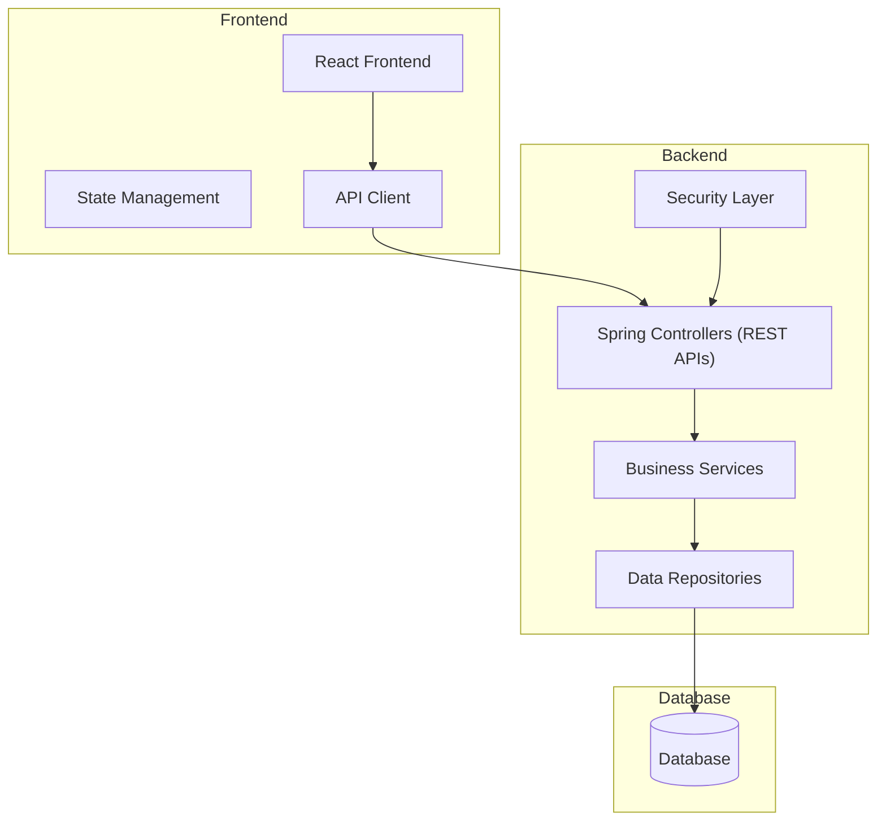
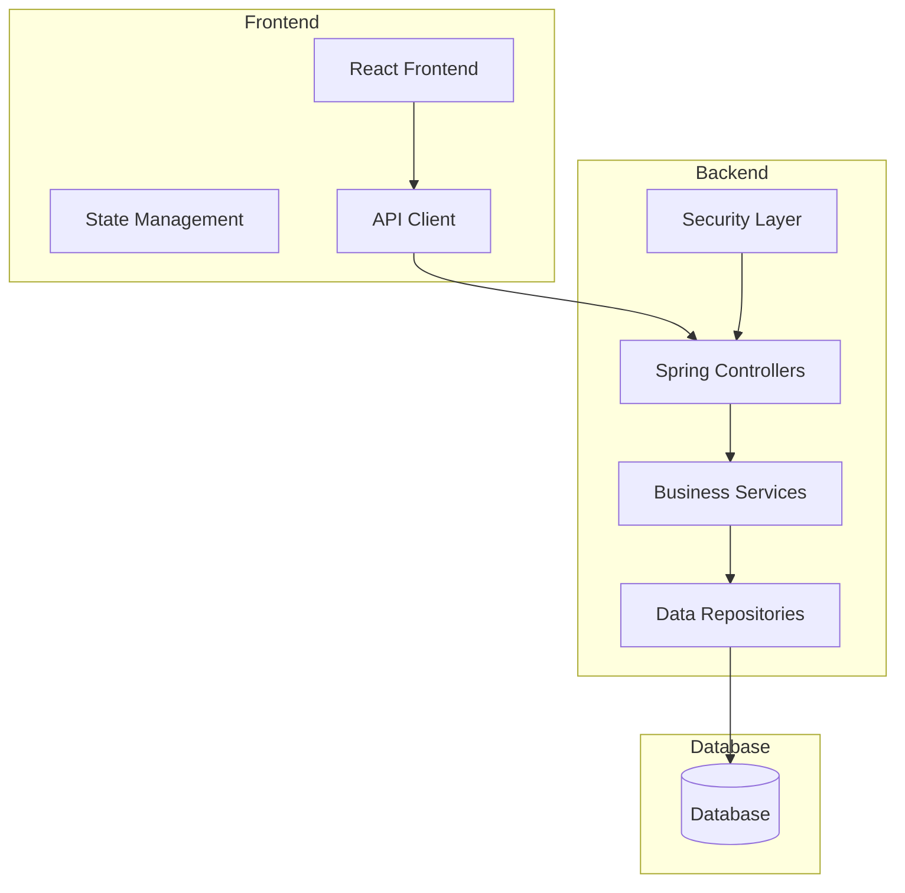
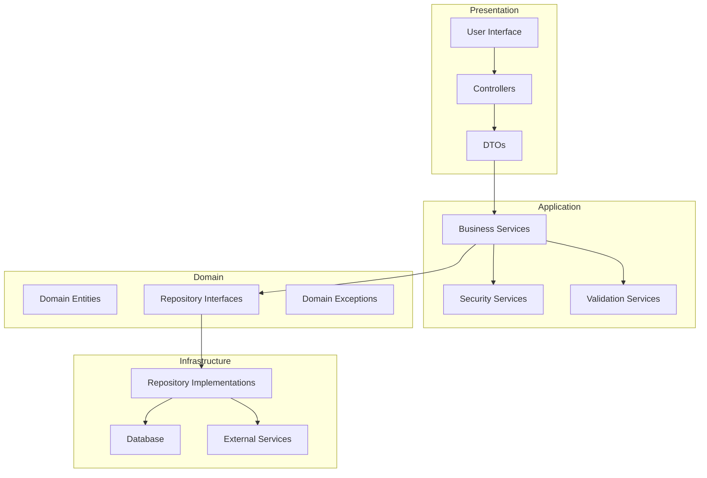
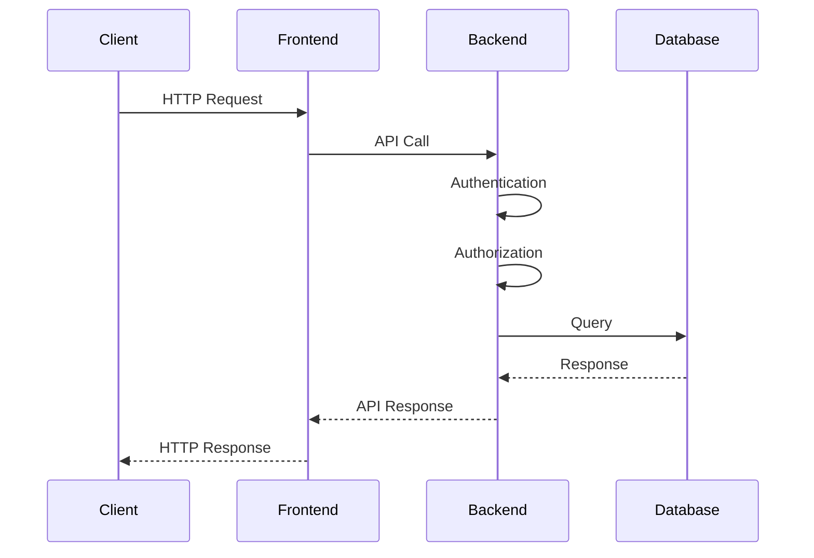
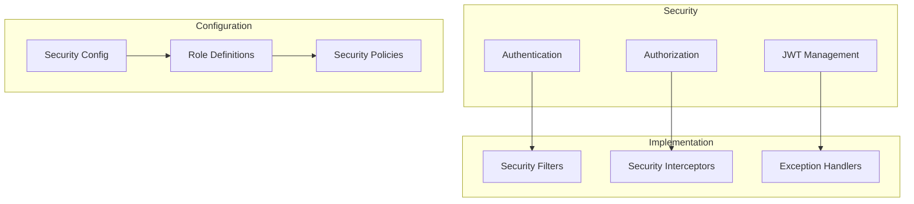
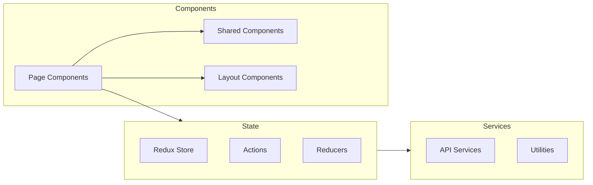

# Architecture Diagrams

## Layered Architecture: Services & APIs

**Explanation:**
- The Presentation Layer exposes REST APIs via Controllers, which use DTOs to communicate with the Application Layer.
- The Application Layer contains business logic, security, and validation services.
- The Domain Layer defines core entities, repository interfaces, and domain-specific exceptions.
- The Infrastructure Layer implements data persistence and external integrations.

## High-Level Architecture: Tutorial Project

**Explanation:**
- The React frontend interacts with the backend via an API client.
- The backend exposes REST APIs, processes business logic, and persists data in the database.
- Security is enforced at the backend controller level.

## Architecture Explanation

### Overview
The KT Tutorial project follows a layered architecture pattern, ensuring separation of concerns, maintainability, and scalability. Each layer has specific responsibilities and interacts with other layers in a controlled manner.

### Layer-by-Layer Explanation

#### 1. Presentation Layer
- **Components**: User Interface, Controllers, DTOs
- **Responsibilities**:
  - Handles user interface and interactions
  - Exposes REST APIs via Controllers
  - Converts between DTOs and domain objects
  - Manages data presentation

#### 2. Application Layer
- **Components**: Business Services, Security Services, Validation Services
- **Responsibilities**:
  - Implements business logic
  - Coordinates between different layers
  - Handles security and authentication
  - Manages transactions and cross-cutting concerns

#### 3. Domain Layer
- **Components**: Domain Entities, Repository Interfaces, Domain Exceptions
- **Responsibilities**:
  - Contains business rules and logic
  - Defines domain entities and relationships
  - Manages domain events
  - Defines repository interfaces

#### 4. Infrastructure Layer
- **Components**: Repository Implementations, Database, External Services
- **Responsibilities**:
  - Implements data persistence
  - Handles external service integration
  - Manages configuration
  - Implements technical concerns

### Project Structure
- **Frontend**: Built with React, TypeScript, and Ant Design, following a component-based architecture.
- **Backend**: Developed using Spring Boot, following a layered architecture with clear separation of concerns.
- **Database**: Stores project data and user information.
- **Security**: Implemented using JWT authentication and role-based access control.

### Data Flow
1. Client sends an HTTP request to the frontend.
2. Frontend makes an API call to the backend.
3. Backend processes the request, applies business logic, and interacts with the database.
4. Response is sent back to the frontend and then to the client.

### Best Practices
- **Layer Independence**: Each layer should only depend on the layer directly below it.
- **Data Flow**: Data should flow downward through the layers, with each layer transforming data as needed.
- **Error Handling**: Each layer should handle its own exceptions, with domain exceptions translated to appropriate responses.
- **Security**: Implemented at multiple layers, using proper authentication and authorization.
- **Testing**: Each layer should be independently testable, with appropriate testing strategies for each layer.

## System Overview

## Layered Architecture

## Data Flow

## Security Architecture

## Component Details

