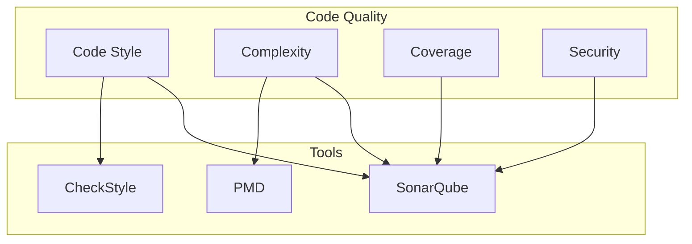
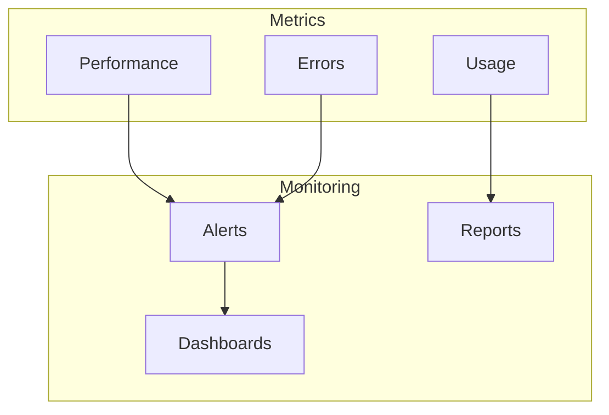
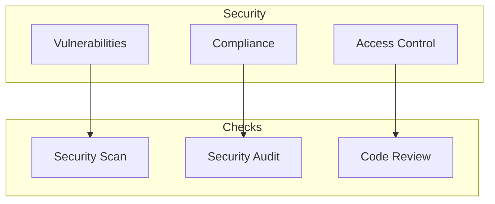
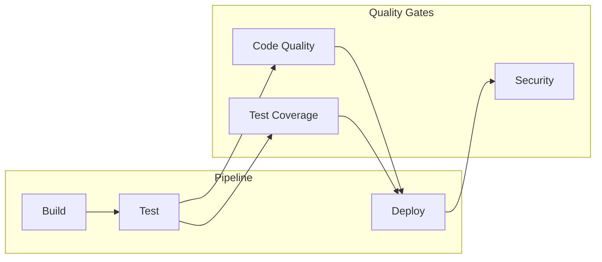

# Quality Assurance Documentation

## Testing Strategy

### Unit Testing
- Minimum coverage requirement: 80%
- Focus areas:
  - Business logic in services
  - Controller endpoints
  - Repository methods
  - Utility functions

### Integration Testing
- API endpoint testing
- Database integration
- Security configuration
- Cross-component interactions

### End-to-End Testing
- User flows
- Critical business processes
- UI/UX validation

## Code Quality Metrics

### Static Code Analysis

## Quality Gates

### Code Quality Gates
1. Code Coverage > 80%
2. No critical security vulnerabilities
3. No code smells
4. All tests passing
5. No duplicate code > 3%

### Performance Gates
1. API response time < 200ms
2. Page load time < 2s
3. Memory usage < 512MB
4. CPU usage < 50%

## Monitoring and Metrics

### Application Metrics

## Security Quality Checks

### Security Testing
1. OWASP Top 10 vulnerabilities
2. Dependency scanning
3. SAST (Static Application Security Testing)
4. DAST (Dynamic Application Security Testing)

### Security Metrics

## Documentation Quality

### Documentation Requirements
1. API Documentation
   - OpenAPI/Swagger specifications
   - Endpoint documentation
   - Request/Response examples

2. Code Documentation
   - Javadoc/TSDoc comments
   - Architecture documentation
   - Setup instructions

3. User Documentation
   - User guides
   - API usage guides
   - Troubleshooting guides

## Continuous Integration/Continuous Deployment

### CI/CD Pipeline

## Performance Testing

### Performance Metrics
1. Response Time
   - Average: < 200ms
   - 95th percentile: < 500ms
   - 99th percentile: < 1000ms

2. Throughput
   - Requests per second
   - Concurrent users
   - Database operations

3. Resource Usage
   - CPU utilization
   - Memory consumption
   - Network bandwidth

## Accessibility Standards

### WCAG 2.1 Compliance
1. Perceivable
   - Text alternatives
   - Time-based media
   - Adaptable content
   - Distinguishable content

2. Operable
   - Keyboard accessible
   - Enough time
   - Seizures and physical reactions
   - Navigable

3. Understandable
   - Readable
   - Predictable
   - Input assistance

4. Robust
   - Compatible
   - Assistive technology support 